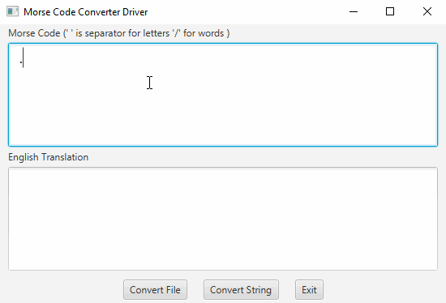

# MorseCodeConverter
A Morse Converter Utility Application that converts Morse Code to plan english.
The alphabet is kept in a Binary Tree. To covnert morse code to english, the Binary tree is traversed according to a provided string of
'.' and '-' characters. The '-' character means go right and the '.' character means go left. 
## Video Walkthrough:

## Concepts:
[] Java Progamming Langauge
[] Data Structures
